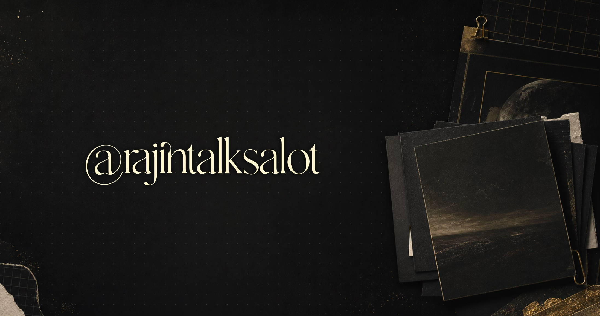

<div align="center">



# rajintalksalot

##### A dark, minimal, image-first archive for visual essays, media notes, art dives, and stray thoughts that started life on Instagram.

[](https://astro.build)
[](https://pnpm.io)
[](/)

</div>

---

## What This Is

**rajintalksalot** is the web version of my Instagram-based creative blog, built as a visual archive rather than a traditional publication site.

The site is designed around the feeling of moving through stacked image posts: calm, dark, minimal, sharp, and a little tactile. The home page is an image-first grid of post stacks. Each post opens into a focused reading view where the images stay central and the caption has enough room to breathe.

The goal is simple: make the Instagram posts feel like they belong on the web without turning them into a heavy CMS, a marketing page, or a normal blog template.

---

## Design Philosophy

- **Visual first**: the post images are the interface, not decoration.
- **Dark and quiet**: restrained colors, subtle texture, small metadata, no loud hero section.
- **Snappy movement**: stacked post cards, smooth transitions, and scroll behavior that feels physical without being noisy.
- **Static and durable**: content lives in files, images live beside their posts, and the site builds into plain static output.
- **Simple to maintain**: adding a post should mean adding a folder, a caption, images, and metadata.

---

## Tech Stack

| Layer | Choice |
| --- | --- |
| Framework | Astro |
| Styling | Plain CSS |
| Content | Local file-based posts |
| Images | Sharp-generated WebP/AVIF derivatives |
| Package Manager | pnpm |
| Output | Static site |

> Important: this project uses **pnpm**. Do not use `npm install` for web app work in this repo.

---

## Project Structure

```text
RAJINTALKSALOT/
├── README.md
└── web/
    ├── astro.config.mjs
    ├── content/
    │   ├── brand/
    │   │   └── images/
    │   │       └── main-logo.png
    │   └── posts/
    │       └── post-slug/
    │           ├── meta.json
    │           ├── content.md
    │           └── images/
    │               ├── 1a.png
    │               ├── 1b.png
    │               └── ...
    ├── public/
    │   ├── cover.png
    │   ├── og-image.png
    │   └── media/
    ├── scripts/
    │   └── optimize-images.mjs
    └── src/
        ├── data/
        ├── layouts/
        ├── lib/
        ├── pages/
        ├── scripts/
        └── styles/
```

The web app is self-contained inside `web/`. The old source-export folder is no longer required for the site to build or run.

---

## Running Locally

```bash
cd web
pnpm install
pnpm run optimize:images
pnpm run dev
```

Build the production site:

```bash
cd web
pnpm run build
```

Preview the production build:

```bash
cd web
pnpm run preview
```

---

## Available Scripts

| Command | Purpose |
| --- | --- |
| `pnpm run dev` | Starts the Astro development server |
| `pnpm run build` | Builds the static site into `web/dist` |
| `pnpm run preview` | Serves the built site locally |
| `pnpm run optimize:images` | Generates optimized WebP/AVIF media from source images |

Run `pnpm run optimize:images` after adding or changing post images.

---

## Adding a Post

Create a new folder inside `web/content/posts/`:

```text
web/content/posts/vincent-van-gogh/
├── meta.json
├── content.md
└── images/
    ├── 8a.png
    ├── 8b.png
    ├── 8c.png
    └── ...
```

Add the post metadata in `meta.json`:

```json
{
  "id": 8,
  "slug": "vincent-van-gogh",
  "title": "Vincent Van Gogh",
  "series": "Not Gatekeeping",
  "date": "2026-05-10",
  "instagramUrl": "https://www.instagram.com/rajintalksalot/p/DYKhsFJmk73/",
  "slides": ["8a.png", "8b.png", "8c.png"]
}
```

Then write the caption/body in `content.md`.

The `slides` array controls the exact image order for the home stack, carousel, and post view. If it is omitted, images are read from the post's `images/` folder in natural filename order.

After adding the post:

```bash
cd web
pnpm run optimize:images
pnpm run build
```

---

## Content Rules

- Keep original post images inside the post's own `images/` folder.
- Use `content.md` for the full caption or essay text.
- Use `meta.json` for ordering, title, series, date, Instagram URL, and slide order.
- Ignore videos for now unless the site adds video support later.
- Keep brand assets in `web/content/brand/images/`.
- Do not manually edit generated files inside `web/public/media/`; regenerate them instead.

---

## Main Features

- Dark visual archive grid with one stack per post.
- Filter pills ordered by the most-used series.
- Touch-aware card previews on devices that do not support hover.
- Desktop post pages with a WPRC-inspired stacked scroll carousel.
- Portrait and narrow post pages with a simpler horizontal image carousel.
- Sticky readable caption layout on larger screens.
- Smooth home-to-post transition with blackout and staged card reveal.
- Local content architecture with per-post folders.
- Optimized image outputs for faster static delivery.
- SEO metadata, Open Graph image, Twitter cards, robots, sitemap, and JSON-LD.

---

## SEO and Social Preview

The social preview image is based on:

```text
web/public/cover.png
```

Generated social assets:

```text
web/public/og-image.png
web/public/og-image.jpg
web/public/og-image-small.jpg
```

The site URL is configured in `web/astro.config.mjs`:

```js
site: "https://rajintalksalot.vercel.app"
```

SEO helpers live in:

```text
web/src/lib/seo.ts
```

---

## Deployment

This is a static Astro site. Any static host should work as long as it serves the contents of `web/dist`.

Recommended build settings:

| Setting | Value |
| --- | --- |
| Root directory | `web` |
| Install command | `pnpm install` |
| Build command | `pnpm run build` |
| Output directory | `dist` |

---

## Personal Note

This project is intentionally small in concept and careful in execution. It is not trying to become a platform. It is a home for a very specific kind of post: visual, reflective, slightly dramatic, and better experienced as a sequence than as a feed.

The web version exists so those pieces can breathe.
